# Hi, I'm Makoto Sato 👋

**M1 student at Nagoya University**

🔗 **Full profile & portfolio → [maco-macoo.github.io](https://maco-macoo.github.io/)**

 

<a href="#"><picture><source media="(prefers-color-scheme: dark)" srcset="./profile/stats-dark.svg"></picture></a>
<a href="#"><picture><source media="(prefers-color-scheme: dark)" srcset="./profile/top-langs-dark.svg"></picture></a>

